# Moonbeam Grant Delivery Report

## `Milestone 1` — Smart Contract Development

| Specification |
|-|
| 0. Researched about Moonbeam [NFT token standards](https://docs.moonbeam.network/builders/build/eth-api/dev-env/openzeppelin/contracts/#deploying-an-erc-721-token) and other factors & protocols that distinguish it from other chains We have developed smart contracts that can: 1. Support Singe & Batch transfers - ([ERC-721/ERC-1155](https://github.com/XP-NETWORK/XP.network-HECO-Migration/blob/f474704150da557f931e011026d0c033b391bd7a/dist/Minter.d.ts)) 2. [Freeze](https://github.com/XP-NETWORK/XP.network-HECO-Migration/search?q=freeze)/[Unfreeze](https://github.com/XP-NETWORK/XP.network-HECO-Migration/search?q=unfreeze) Native NFTs 3. [Mint](https://github.com/XP-NETWORK/XP.network-HECO-Migration/search?q=mint)/[Burn](https://github.com/XP-NETWORK/XP.network-HECO-Migration/search?q=burn) wrapped NFTs 4. [Withdraw](https://github.com/XP-NETWORK/XP.network-HECO-Migration/search?q=withdraw) the TX fees on the target chain in native tokens 5. Trust the [multisig](https://github.com/XP-NETWORK/frost-secp256k1) of the bridge oracle validators 6. [Whitelist](https://github.com/XP-NETWORK/XP.network-HECO-Migration/search?q=whitelist) NFT smart contracts 7. [Pause](https://github.com/XP-NETWORK/XP.network-HECO-Migration/search?q=pause)/[Unpause](https://github.com/XP-NETWORK/XP.network-HECO-Migration/search?q=unpause) for maintenance or if compromised 10. [Add / Remove](https://github.com/XP-NETWORK/XP.network-HECO-Migration/search?q=validate) validator 11. Set consensus [threshold](https://github.com/XP-NETWORK/XP.network-HECO-Migration/search?q=threshold)|

# TODO

## `Milestone 2` — Testing & Documenting

| Length | Deliverable | Specification |
|-|-|-|
| 1 week | Tests & Documentation | 1. We will provide both inline documentation of the code and a basic tutorial that can interact with the deployed smart contracts and backend service. 2. The code will have proper unit-test coverage 85% to ensure functionality and robustness. In the guide, we will describe how to run these tests preparing for auditing 3. [Deploying and testing](#deployment--testing-smart-contracts) the contracts in the testnet environment|

### Deployment & Testing Smart contracts:

#### The bridge smart contract have been deployed on Moonbeam Alpha

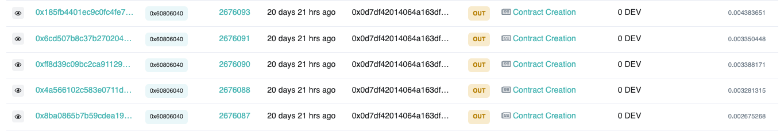

| Contract Name | Address| Functionality|
|:-:|:-:|:-|
|Bridge Endpoint|0x0F00f81162ABC95Ee6741a802A1218C67C42e714|1. Interactions with the oracle-validators 2. Orchestrating NFT contracts|
|ERC-721 Minter| 0x1F71E80E1E785dbDB34c69909C11b71bAd8D9802| Minting NFTs for testing purposes|
|ERC-1155 Minter| 0x10E3EE8526Cc7610393E2f6e25dEee0bD38d057e| Minting NFTs for testing purposes|
|ERC-721|0x42027aF22E36e839e138dc387F1b7428a85553Cc|The default contract for accepting wrapped NFTs|
|ERC-1155|0xd023739a76Df4cC6260A1Ba25e8BEbCe8389D60D|The default contract for accepting wrapped NFTs|
|

#### Moonbeam has been added to the testnet bridge UI

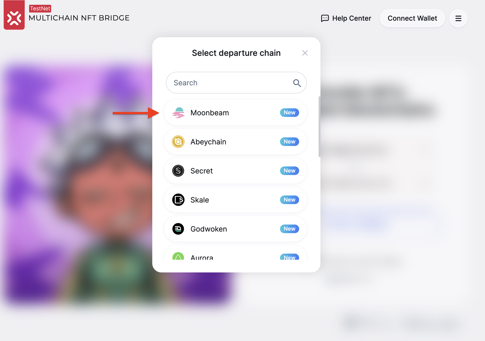

#### Transaction fee estimation

The destination TX fee is estimated in native tokens on Moonbeam after at least one NFT has been selected.

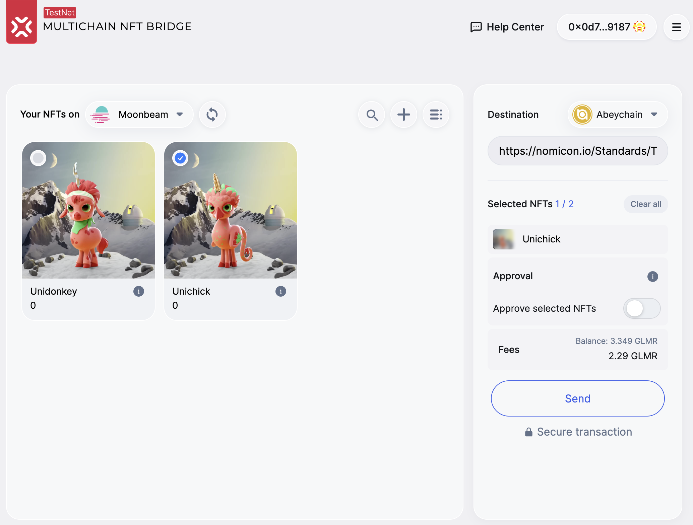

#### Viewing NFT details

Click the <svg width="24" height="24" viewBox="0 -4 24 24" fill="none" xmlns="http://www.w3.org/2000/svg" class="svgWidget nftInfIcon" alt="inf"><path fill-rule="evenodd" clip-rule="evenodd" d="M12 20C16.4183 20 20 16.4183 20 12C20 7.58172 16.4183 4 12 4C7.58172 4 4 7.58172 4 12C4 16.4183 7.58172 20 12 20ZM11.5309 8.20241C11.6766 8.06586 11.8583 8 12.0649 8C12.2706 8 12.4504 8.06538 12.5901 8.2041C12.7373 8.34306 12.8084 8.52395 12.8084 8.73271C12.8084 8.94752 12.7382 9.13468 12.5918 9.28103C12.4519 9.42095 12.2715 9.48688 12.0649 9.48688C11.8583 9.48688 11.6766 9.42102 11.5309 9.28447L11.5237 9.2777C11.386 9.13082 11.3215 8.94462 11.3215 8.73271C11.3215 8.52619 11.3874 8.34576 11.5274 8.20585L11.5309 8.20241ZM10.6562 10.3821H12.6689V14.9776C12.6689 15.1012 12.6716 15.1962 12.6765 15.2642C12.6787 15.294 12.6812 15.3168 12.6838 15.3334C12.701 15.3393 12.7285 15.3459 12.7696 15.3511L13.4951 15.4303V16H10.6562V15.4303L11.3818 15.3511C11.4228 15.3459 11.4504 15.3393 11.4676 15.3334C11.4701 15.3168 11.4726 15.294 11.4748 15.2642C11.4798 15.1962 11.4825 15.1012 11.4825 14.9776V11.4045C11.4825 11.2808 11.4798 11.1858 11.4748 11.1179C11.4726 11.0881 11.4701 11.0653 11.4676 11.0486C11.4506 11.0428 11.4234 11.0363 11.3831 11.0311L10.6562 10.965V10.3821Z" fill="#62718A"></path></svg> icon at the lower right corner of the NFT Card to see the details of the token.

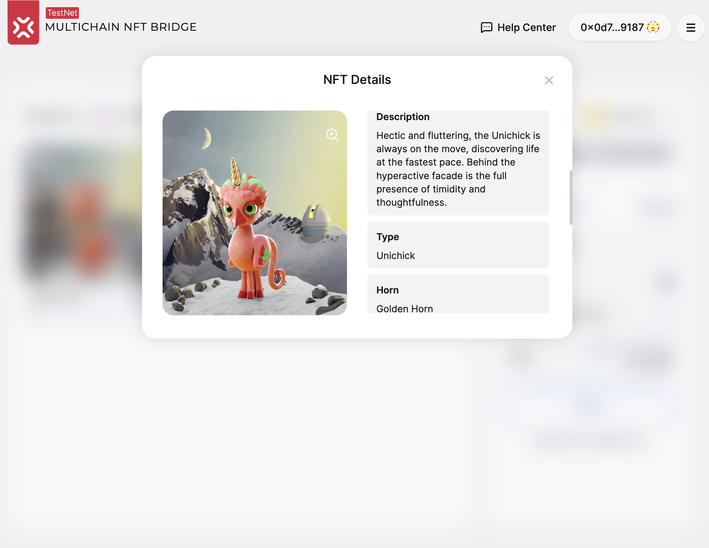

#### Approving

To make the bridge contract the operator of the NFT the Owner of the asset has to approve it in the smart contract holding the ledger of this token.

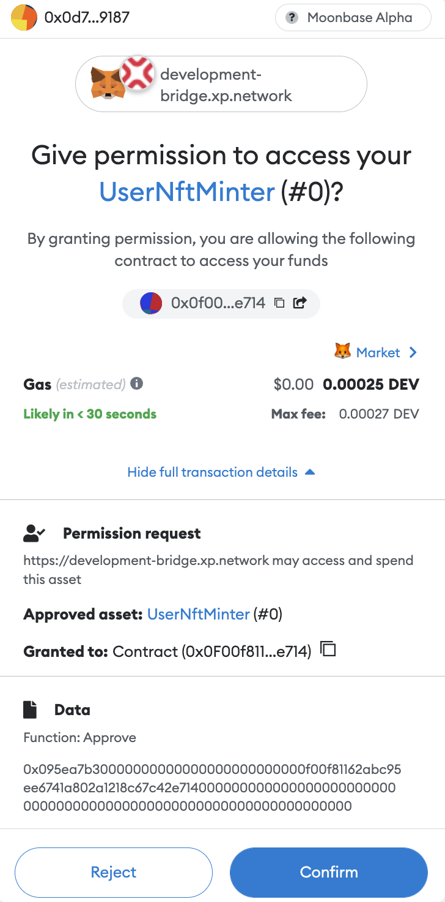

Had the transaction been successful, the indicator to the right from the `Approve selcted NFTs` is set to `true`.

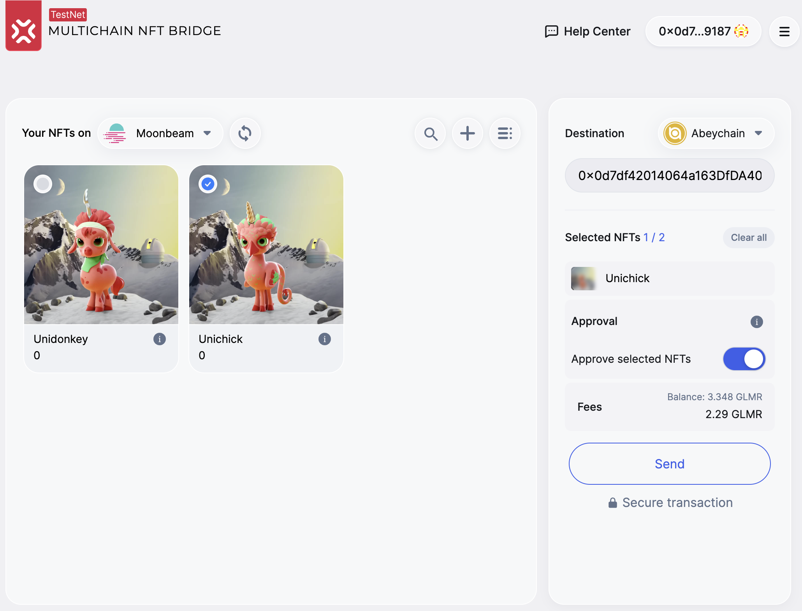

#### Transferring

After the destination address is set and the Approval is set to true, the `Send` button becomes active.

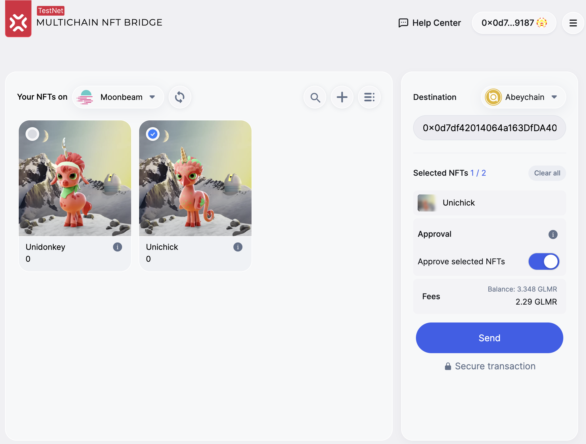

The fee is comprised of two parts:

1. The native chain fee to award the validators (for example, 0.00024068 DEV)
2. The destination TX fee charged by the bridge in the native tokens (2.286 DEV)

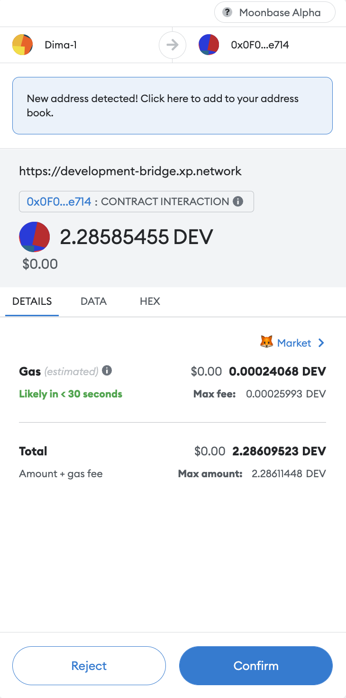

#### Seeing the result

The transaction hashes at the bottom of the `Bridging results` screen are clickable links that take the user to the explorer of the relevant chain.

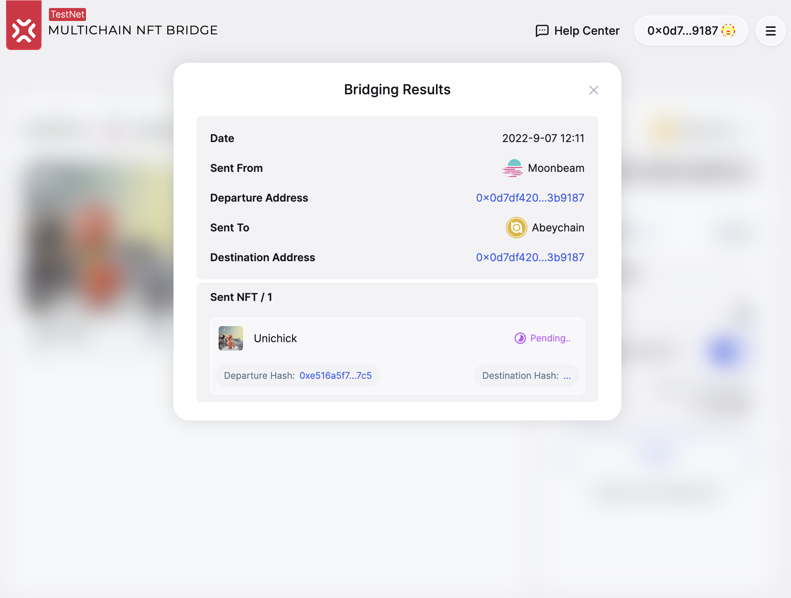

The transaction hash from the examle transaction is the following: https://moonbase.moonscan.io/tx/0xe516a5f70643125bc485d033fe937cafcede70f1be7a18817ec4b406843327c5

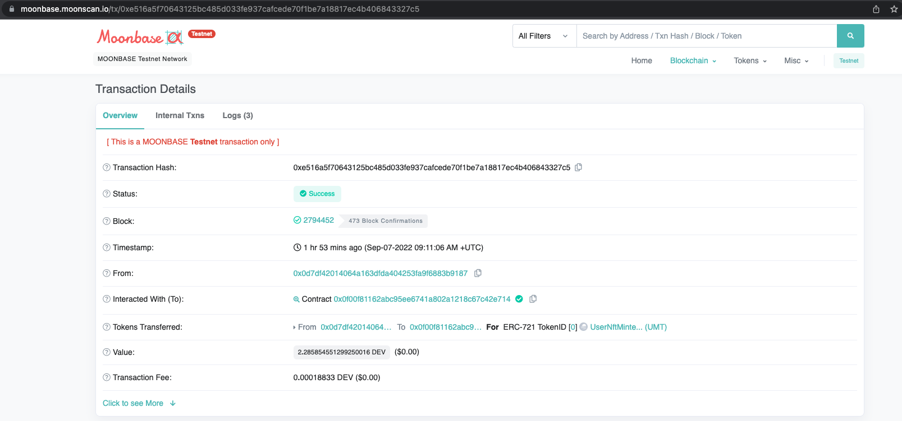

#### Checking the result in the Bridge UI

The NFT card displaying the transferred NFT is gone after the transfer, indicating that the `NFT-Indexer` works correctly.

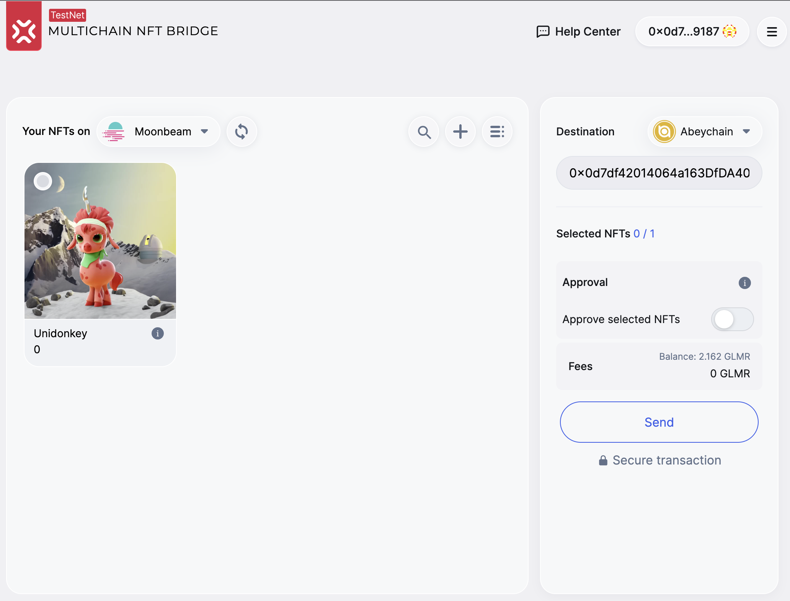

## `Milestone 3` — Integrating into the Live Bridge
| Length | Deliverable | Specification |
|-|-|-|
| 2 weeks | Validators, Backend, Frontend | 1. Developing validation logic relevant for the Moonbeam part of the bridge 2. Adding Moonbeam to the Bridge NFT-Indexer 3. Integrating TX fee estimation 4. Plugging Moonbeam in the heartbeat 5. Integrating with a Moonbeam rpc node 6. Integrating Moonbeam in the bridge UI 7. Deploying smart contracts 8. Adding Moonbeam to the bridge JS library 9. Adding Moonbeam to the bridge widget|