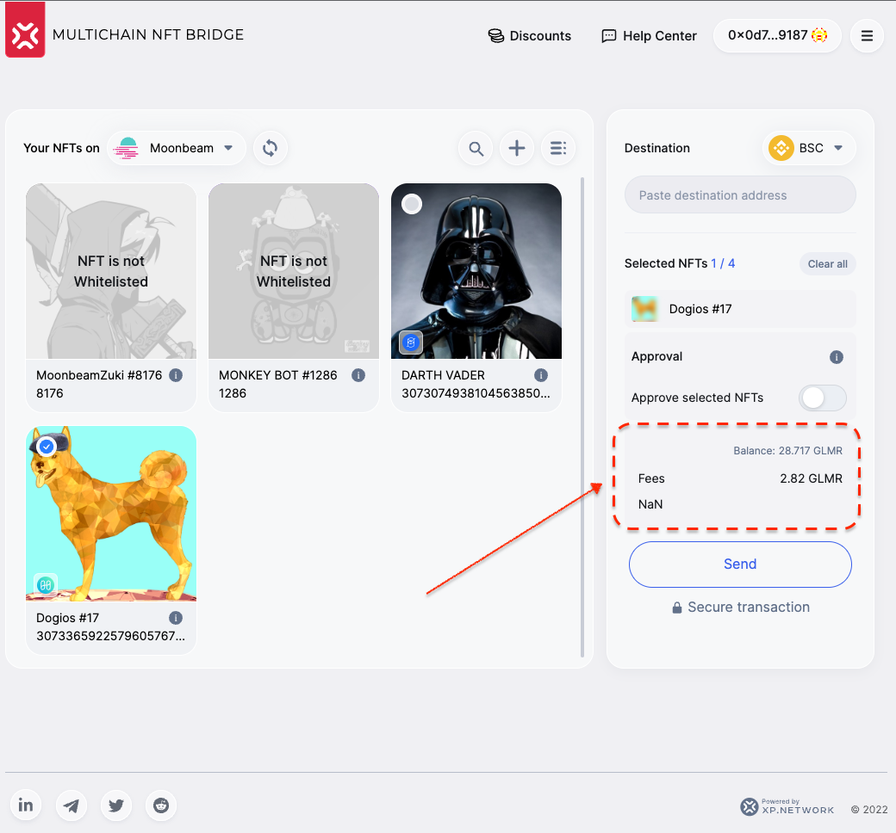

# Moonbeam Grant Delivery Proofs

## 3.1 Validation Logic

Off-chain validators relay the transactions from one chain to another via the nodes of the respective chains. Without proper validation & signatures assets will not arrive to the destination chain. Here's proof of the validators' proper work:

From Moonbeam Mainnet:


|Moonbeam TX|Target TX|
|:-:|:-:|
|[Origin](https://moonscan.io/tx/0x2038ee139eec4a1b3d20f76aa0e527c39c3cb5fa930677084e78d2718579bf97)|[Destination](https://explorer.harmony.one/tx/0xba7e2118ba3e99f8819177160ab108363e77dee0caa840d93f29057fc53ef44e)|
|[Origin](https://moonscan.io/tx/0x013b95408b531ddb62cec179f4f0f576560f6ad0304010dd6c293d493fcd6476)|[Destination](https://bscscan.com/tx/0xd4a4c8689d14bd9a4a68bd30944e629d805b35a146d3111e41405ffafbec3a45)|
|[Origin](https://moonscan.io/tx/0xeadeb294d3a03e42de8371c51fa234c3c227caf19dcf76f9c36ede58839bf995)|[Destination](https://bscscan.com/tx/0xd6a457928c68ce318d2bc96d35ff6a1ed1af354f39ddb2147867029762a5a272)|

TO the Moonbeam mainnet:

|Moonbeam TX|Target TX|
|:-:|:-:|
|[Origin](https://explorer.harmony.one/tx/0x6750fc43132581522d13d799cf1a092858287ba1695917913a6e812ac8bc7972)|[Destination](https://moonscan.io/tx/0xef57ea6a9939db6ec96fc9efbc234c6faac83f28c0485737b46b2e6c4527e572)|
|[Origin](https://ftmscan.com/tx/0x94795bdaf1ff5986bc0102bcdfe11133b0411fef5429febda60aecd12ae07fba)|[Destination](https://moonscan.io/tx/0x130890a732f57eb07433e1722cec659661a7e287a82169c9af2c9cdf9adde91f)|
|[Origin](https://bscscan.com/tx/0xd5e9749ff62712fa832d8b06bb1517815d7571bb6ea090da3c1786638f835ca4)|[Destination](https://moonscan.io/tx/0x4381ae63507cbeb0c775e78845899915ea1f55a22d948b59e96abf920579f7a4)|

## 3.2 NFT Indexing

API structure:

```http
curl \
-X GET \
-H "Accept: application/json" \
"https://<api-endpoint>/nfts/<chainId>/<user-adderss>"
```

Moonbeam chainId: 

```shell
32
```

Testnet API Endpoint: 
```
testnet-notifier.xp.network/testnet-indexer/
```

Testnet Example: [https://testnet-notifier.xp.network/testnet-indexer/nfts/32/0x0d7df42014064a163DfDA404253fa9f6883b9187](https://testnet-notifier.xp.network/testnet-indexer/nfts/32/0x0d7df42014064a163DfDA404253fa9f6883b9187)

Mainnet Endpoint:

```shell
nft-index.xp.network/index/
```

Mainnet Example: [https://nft-index.xp.network/index/nfts/32/0x6449b68cc5675f6011e8DB681B142773A3157cb9](https://nft-index.xp.network/index/nfts/32/0x6449b68cc5675f6011e8DB681B142773A3157cb9)

## 3.3 TX Fee estimation

To test run in the terminal:
```bash
yarn estimate
```
For the code snippet check [estimate.ts](./src/estimate.ts)

Example output:

```bash
$ tsc && node ./dist/estimate.js
0x0d7df42014064a163DfDA404253fa9f6883b9187
Listing NFTs for Moonbeam:
On Moonbeam Found NFTs: 2
{
  uri: 'https://meta.polkamon.com/meta?id=10001419694',
  native: {
    chainId: '32',
    tokenId: '0',
    owner: '0x0d7df42014064a163DfDA404253fa9f6883b9187',
    contract: '0x1F71E80E1E785dbDB34c69909C11b71bAd8D9802',
    symbol: 'UMT',
    name: 'UserNftMinter',
    uri: 'https://meta.polkamon.com/meta?id=10001419694',
    contractType: 'ERC721'
  },
  collectionIdent: '0x1F71E80E1E785dbDB34c69909C11b71bAd8D9802'
}
Estimation 3021599742997896150
✨  Done in 12.41s.
```

## 3.4 Heartbeat

Heartbeat is a tool monitoring liveliness of the chain nodes, and the bridge validators. If the nodes are not responsive or the number of the active validators is below the threshold, the blockchain is automatically disable in the bridge & the widget UI to avoid errors or stuck assets.

Link: https://bridgestatus.herokuapp.com/status

The internal bridge chain nonce for Moonbeam is 32

## 3.5 RPC Nodes

Integrated RPC nodes:

|Network|URI|Proof|
|:-:|:-:|:-:|
|Testnet|https://rpc.api.moonbase.moonbeam.network|[link](https://github.com/XP-NETWORK/xpjs/blob/secretjs/src/consts.ts#L57)|
|Mainnet|https://rpc.api.moonbeam.network|[link](https://github.com/XP-NETWORK/xpjs/blob/secretjs/src/consts.ts#L87)|

## 3.6 Bridge UI

Link: https://staging-bridge.xp.network/#

1. Moonbeam is availiable as a chain of departure or destination:


2. NFT Indexing works in the UI


3. Fee estimation in the UI


4. Transferring TO Moonbeam


5. Transferring FROM Moonbeam


## 3.7 Mainnet Contracts

|Contract Name|Address|Links|
|:-:|:-:|:-:|
|Bridge Contract|0xBA3Cc81cfc54a4ce99638b5da1F17b15476E7231|[Link](https://moonscan.io/address/0xBA3Cc81cfc54a4ce99638b5da1F17b15476E7231)|
|Default ERC-721|0xfD3Ce0a10D4731b136a7C9e3f8a37edA1EFbf77f|[Link](https://moonscan.io/address/0xfD3Ce0a10D4731b136a7C9e3f8a37edA1EFbf77f)|
|Default ERC-1155|0xe535A8De7C42a8bc1633f16965fbc259a3Ef58B6|[Link](https://moonscan.io/address/0xe535a8de7c42a8bc1633f16965fbc259a3ef58b6)|

## 3.8 JS Library integration

Links: 
1. https://github.com/XP-NETWORK/xpjs/search?q=moonbeam
2. https://github.com/XP-NETWORK/xpjs/search?q=moon
3. https://github.com/XP-NETWORK/xpjs/search?q=moonbeam&type=commits


## 3.9 Widget Integration

To be integrated on October 23-27
