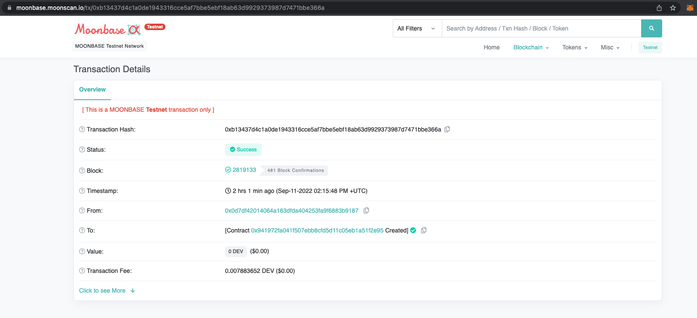

# Bridging to/from Moonbeam tutorial

To interact with the bridge from Moonbeam/Moonbase Alpha, you can use this repository. In case you're reading this long after this repository was created, see our [JavaScript Library](https://github.com/XP-NETWORK/xpjs) repository for updates.

To test this, follow the steps described below.

## 1. Setup

Enter the project folder & iinstall the dependencies:
```
cd moonbeam-grant-delivery/
yarn
```

Rename the [`.env.example`](./.env.example) file to `.env` and provide the values for each key.

```bash
# Your private key
SK=

# UserNftMinter ERC721 Contract address (see ./contracts/UMT.sol)
UMT=
```

## 2. Deploy a contract on Moonbeam or Moonbase Alpha

For example, take the contract from the [`./contracts/UMT.sol`](./contracts/UMT.sol)


Viewing the contract creation transaction on the chain:
https://moonbase.moonscan.io/tx/0xb13437d4c1a0de1943316cce5af7bbe5ebf18ab63d9929373987d7471bbe366a



## 3. Mint NFTs for testing

In case you're in the Testnet environment, there will be very few, if any, NFTs for testing the bridge functionality. Mint one or several tokens to try the functionality.

Run in the terminal:

```bash
yarn mint
```

Expected output (Example):

```bash
Minted https://meta.polkamon.com/meta?id=10001419693 {
  type: 2,
  chainId: 1287,
  nonce: 30,
  maxPriorityFeePerGas: BigNumber { _hex: '0x59682f00', _isBigNumber: true },
  maxFeePerGas: BigNumber { _hex: '0xd09dc300', _isBigNumber: true },
  gasPrice: null,
  gasLimit: BigNumber { _hex: '0x0f4240', _isBigNumber: true },
  to: '0x941972fa041F507eBb8CfD5d11C05Eb1a51f2E95',
  value: BigNumber { _hex: '0x00', _isBigNumber: true },
  data: '0xd85d3d270000000000000000000000000000000000000000000000000000000000000020000000000000000000000000000000000000000000000000000000000000002d68747470733a2f2f6d6574612e706f6c6b616d6f6e2e636f6d2f6d6574613f69643d313030303134313936393300000000000000000000000000000000000000',
  accessList: [],
  hash: '0x75baae58dab1a8e41171e7e2173a2ba23007865203b91b33afb478ede365fcdd',
  v: 1,
  r: '0xdb6d0b914ffb288b6cc7b47ecee53cda0c197d6ec12447aa663257eac743326e',
  s: '0x08062e74a4cf6ec1183d5b43b6922b4b30717804b576d41238fb35a74b3036c3',
  from: '0x0d7df42014064a163DfDA404253fa9f6883b9187',
  confirmations: 0,
  wait: [Function (anonymous)]
}
✨  Done in 15.75s.
```
The code is available in [`./src/mint.ts`](./src/mint.ts)

Viewing the minting transaction in the explorer:
https://moonbase.moonscan.io/tx/0x75baae58dab1a8e41171e7e2173a2ba23007865203b91b33afb478ede365fcdd


## 4. Listing (viewing) NFTs

To see the NFTs a user has on Moonbeam run in the terminal

```bash
yarn list_nfts
```

Example output:

```bash
Listing NFTs for Moonbeam:
On Moonbeam Found NFTs: 3
[
  {
    uri: 'https://meta.polkamon.com/meta?id=10001419693',
    native: {
      chainId: '32',
      tokenId: '0',
      owner: '0x0d7df42014064a163DfDA404253fa9f6883b9187',
      contract: '0x941972fa041F507eBb8CfD5d11C05Eb1a51f2E95',
      symbol: 'UMT',
      name: 'UserNFTMinter',
      uri: 'https://meta.polkamon.com/meta?id=10001419693',
      contractType: 'ERC721'
    },
    collectionIdent: '0x941972fa041F507eBb8CfD5d11C05Eb1a51f2E95'
  }
]
✨  Done in 6.99s.
```
The code is available in [`./src/list.ts`](./src/list.ts)

## 5. Approving

To allow the bridge smart contract withdraw an NFT from the user, lock it and transfer it to a foreign chain asste owner's approval is required.
To approve run in the terminal:

```bash
yarn approve
```

Example output:

```bash
Listing NFTs for Moonbeam:
On Moonbeam Found NFTs: 3
Selected: {
  uri: 'https://meta.polkamon.com/meta?id=10001419693',
  native: {
    chainId: '32',
    tokenId: '0',
    owner: '0x0d7df42014064a163DfDA404253fa9f6883b9187',
    contract: '0x941972fa041F507eBb8CfD5d11C05Eb1a51f2E95',
    symbol: 'UMT',
    name: 'UserNFTMinter',
    uri: 'https://meta.polkamon.com/meta?id=10001419693',
    contractType: 'ERC721'
  },
  collectionIdent: '0x941972fa041F507eBb8CfD5d11C05Eb1a51f2E95'
}
Approving NFTs for Moonbeam:
Approved: 0x9e27eed1f7f4d0fe347926129c9c1c9d189440f2322e8b8b5dea235cd7e018a2
✨  Done in 40.34s.
```
The code is available in [`./src/approve.ts`](./src/approve.ts)

Viewing the approval confirmation in the chain explorer:
https://moonbase.moonscan.io/tx/0x9e27eed1f7f4d0fe347926129c9c1c9d189440f2322e8b8b5dea235cd7e018a2


## 6. Transferring an NFT to a foreign chain

To transfer an NFT run in the terminal

```bash
yarn transfer
```

Example output:

```bash
Listing NFTs for Moonbeam:
On Moonbeam Found NFTs: 3
Selected: {
  uri: 'https://meta.polkamon.com/meta?id=10001419693',
  native: {
    chainId: '32',
    tokenId: '0',
    owner: '0x0d7df42014064a163DfDA404253fa9f6883b9187',
    contract: '0x941972fa041F507eBb8CfD5d11C05Eb1a51f2E95',
    symbol: 'UMT',
    name: 'UserNFTMinter',
    uri: 'https://meta.polkamon.com/meta?id=10001419693',
    contractType: 'ERC721'
  },
  collectionIdent: '0x941972fa041F507eBb8CfD5d11C05Eb1a51f2E95'
}
2503738092700233400
Minting With : 0x783eF7485DCF27a3Cf59F5A0A406eEe3f9b2AaeB
Transfer result: {
  type: 2,
  chainId: 1287,
  nonce: 32,
  maxPriorityFeePerGas: BigNumber { _hex: '0x59682f00', _isBigNumber: true },
  maxFeePerGas: BigNumber { _hex: '0xd09dc300', _isBigNumber: true },
  gasPrice: null,
  gasLimit: BigNumber { _hex: '0x017f30', _isBigNumber: true },
  to: '0x0F00f81162ABC95Ee6741a802A1218C67C42e714',
  value: BigNumber { _hex: '0x22bf1087aa02eeb8', _isBigNumber: true },
  data: '0x90e704e5000000000000000000000000941972fa041f507ebb8cfd5d11c05eb1a51f2e950000000000000000000000000000000000000000000000000000000000000000000000000000000000000000000000000000000000000000000000000000000400000000000000000000000000000000000000000000000000000000000000a00000000000000000000000000000000000000000000000000000000000000100000000000000000000000000000000000000000000000000000000000000002a30783064376466343230313430363461313633446644413430343235336661396636383833623931383700000000000000000000000000000000000000000000000000000000000000000000000000000000000000000000000000000000002a30783738336546373438354443463237613343663539463541304134303665456533663962324161654200000000000000000000000000000000000000000000',
  accessList: [],
  hash: '0x2accbf0cfdf1770f3f6291fc7c6e35faba297f851834d0dd6973e14e1508207d',
  v: 1,
  r: '0x8615b0874deeec56379f3519beddde2057967347c0bf44357728fff3774ecd57',
  s: '0x7f9e49fe041f8d02852444a83c7a7f93842b4a6bdf80fe018c0051885d0c7df9',
  from: '0x0d7df42014064a163DfDA404253fa9f6883b9187',
  confirmations: 0,
  wait: [Function (anonymous)]
}
✨  Done in 41.75s.
```
The code is available in [`./src/transfer.ts`](./src/transfer.ts)

## 7. Viewing the results on chain

https://moonbase.moonscan.io/tx/0x2accbf0cfdf1770f3f6291fc7c6e35faba297f851834d0dd6973e14e1508207d

